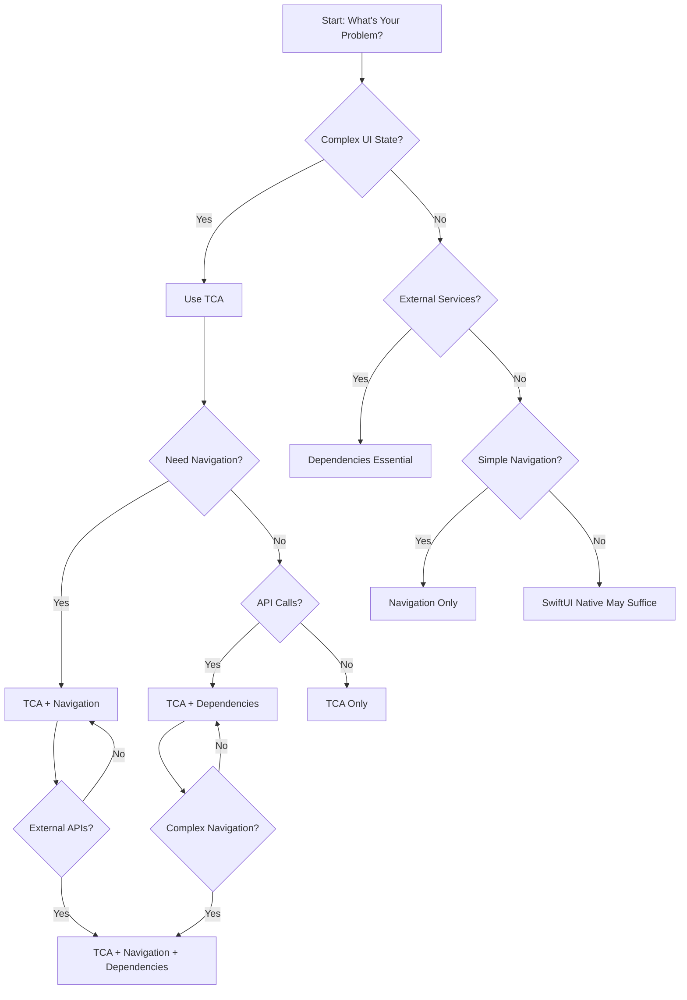

# Framework Selection Decision Trees

**Purpose**: Systematic decision-making for choosing the right Point-Free frameworks for your use case.

## Primary Decision Tree: Overall Architecture



## Decision Tree 1: State Management Requirements

### Start Here: State Complexity Analysis
```
Question 1: How complex is your UI state?
├─ High Complexity
│  ├─ Multiple interconnected components
│  ├─ Complex user interactions
│  ├─ Async operations with UI updates
│  └─ Result: Use TCA (essential)
├─ Medium Complexity
│  ├─ Some shared state between views
│  ├─ Basic user interactions
│  └─ Result: Consider TCA, evaluate cost/benefit
└─ Low Complexity
   ├─ Simple input/output views
   ├─ No shared state
   └─ Result: SwiftUI @State may suffice
```

### State Management Decision Matrix
| Complexity | Features | Recommended Framework | Rationale |
|------------|----------|----------------------|-----------|
| **High** | 10+ state properties, async operations, complex interactions | **TCA** | Predictable state management, testable, scalable |
| **Medium** | 5-10 state properties, some async | **TCA** | Growing complexity benefits from structure |
| **Low** | <5 state properties, simple interactions | **SwiftUI** | Lower overhead, simpler implementation |
| **Minimal** | 1-2 properties, display-only | **SwiftUI** | No need for architecture overhead |

## Decision Tree 2: Dependency Requirements

### External Services Analysis
```
Question 2: Do you need external services?
├─ Yes → Dependencies Essential
│  ├─ Network API calls
│  ├─ Platform services (Camera, Location, etc.)
│  ├─ Database access
│  ├─ Third-party SDKs
│  └─ Result: Dependencies framework required
└─ No → Evaluate other needs
   ├─ Pure local app?
   ├─ Demo or prototype?
   └─ Result: Dependencies may not be needed yet
```

### Dependency Complexity Levels
| Integration Type | Examples | Dependencies Required? | Testing Strategy |
|------------------|----------|------------------------|------------------|
| **Network APIs** | REST, GraphQL | **Yes** | Mock clients, TestStore integration |
| **Platform APIs** | Camera, Location, Notifications | **Yes** | Live mode for demos, mock for tests |
| **Database** | Core Data, SQLite | **Yes** | In-memory databases for tests |
| **Third-party SDKs** | Analytics, Payment | **Yes** | Protocol-based abstraction |
| **File System** | Document storage | **Yes** | Temporary directories for tests |

## Decision Tree 3: Navigation Requirements

### Navigation Complexity Analysis
```
Question 3: How complex is your navigation?
├─ High Complexity
│  ├─ Deep navigation stacks
│  ├─ Conditional navigation flows
│  ├─ Deep linking support
│  ├─ Tab-based + modal + sheet combinations
│  └─ Result: Navigation framework essential
├─ Medium Complexity
│  ├─ Simple tab navigation
│  ├─ Basic modal presentations
│  └─ Result: Consider Navigation framework
└─ Low Complexity
   ├─ Single screen app
   ├─ Simple modal flows
   └─ Result: SwiftUI navigation may suffice
```

### Navigation Decision Matrix
| Navigation Type | SwiftUI Native | Point-Free Navigation | Recommendation |
|-----------------|---------------|----------------------|----------------|
| **Simple Modal** | ✅ Easy | ⚠️ Overkill | SwiftUI |
| **Tab Bar** | ✅ Good | ✅ Better | Either |
| **Deep Stacks** | ❌ Complex | ✅ Clean | Point-Free |
| **Conditional Flows** | ❌ State management | ✅ Integrated | Point-Free |
| **Deep Linking** | ❌ Manual | ✅ Built-in | Point-Free |
| **Multi-path Navigation** | ❌ Complex | ✅ Enum-based | Point-Free |

## Decision Tree 4: Testing Requirements

### Testing Strategy Analysis
```
Question 4: What are your testing needs?
├─ High Testing Requirements
│  ├─ Complex business logic
│  ├─ Critical user flows
│  ├─ Network-dependent features
│  ├─ Production application
│  └─ Result: Comprehensive testing strategy needed
├─ Medium Testing Requirements
│  ├─ Important user flows
│  ├─ Some business logic
│  └─ Result: Balanced testing approach
└─ Low Testing Requirements
   ├─ Simple demo apps
   ├─ Prototypes
   └─ Result: Basic testing sufficient
```

### Testing Framework Selection
| Testing Need | Frameworks | Strategy |
|--------------|-----------|----------|
| **TCA Testing** | Swift Testing + TestStore | Unit tests for reducers |
| **Dependency Testing** | Mock dependencies | Integration tests with mocks |
| **UI Testing** | XCUITest + Snapshot | End-to-end user flows |
| **Navigation Testing** | Navigation state verification | Flow correctness tests |

## Decision Tree 5: Performance Requirements

### Performance Analysis
```
Question 5: What are your performance constraints?
├─ High Performance Requirements
│  ├─ Real-time updates
│  ├─ Large datasets
│  ├─ Complex animations
│  └─ Result: Optimize framework combinations carefully
├─ Medium Performance Requirements
│  ├─ Responsive UI expected
│  ├─ Moderate data sizes
│  └─ Result: Standard patterns usually sufficient
└─ Low Performance Requirements
   ├─ Simple utility apps
   ├─ Prototypes
   └─ Result: Focus on development speed
```

### Performance Considerations by Framework
| Framework | Performance Impact | Optimization Strategies |
|-----------|-------------------|----------------------|
| **TCA** | Medium overhead for state updates | Efficient state design, minimize publishers |
| **Dependencies** | Low overhead, async by design | Proper async/await patterns |
| **Navigation** | Low overhead, efficient path management | Shallow navigation trees |
| **Testing** | Test time overhead | Parallel test execution, selective testing |

## Comprehensive Framework Combinations

### Common Combinations and Use Cases

#### 1. **TCA Only**
```
When to Use:
✅ Complex UI state management
✅ Business logic heavy applications
✅ Predictable state updates needed
❌ No external services
❌ Simple navigation

Example Apps:
- Calculators
- Form-based applications
- Business logic tools
```

#### 2. **TCA + Dependencies**
```
When to Use:
✅ API-driven applications
✅ Database-backed apps
✅ External service integration
✅ Complex business logic

Example Apps:
- Social media feeds
- E-commerce applications
- News readers
```

#### 3. **TCA + Navigation**
```
When to Use:
✅ Multi-screen applications
✅ Complex navigation flows
✅ State-dependent navigation
✅ Deep linking requirements

Example Apps:
- Onboarding flows
- Multi-step wizards
- Content management apps
```

#### 4. **TCA + Dependencies + Navigation**
```
When to Use:
✅ Full-featured applications
✅ Complex user workflows
✅ API-driven navigation
✅ Production applications

Example Apps:
- Banking apps
- Social media applications
- Enterprise applications
```

#### 5. **Dependencies Only**
```
When to Use:
✅ Simple apps with external services
✅ Utility applications
✅ Service integrations
❌ Minimal UI state

Example Apps:
- API clients
- File uploaders
- Service utilities
```

#### 6. **Navigation Only**
```
When to Use:
✅ Content-focused applications
✅ Simple state, complex navigation
✅ Media apps
❌ No complex business logic

Example Apps:
- Photo galleries
- Document viewers
- Media players
```

## Cost-Benefit Analysis

### Framework Combination Costs
| Combination | Learning Curve | Code Overhead | Maintenance | Testing Complexity |
|-------------|----------------|---------------|-------------|-------------------|
| **SwiftUI Only** | Low | Low | Low | Low |
| **TCA Only** | Medium | Medium | Medium | Medium |
| **TCA + Dependencies** | High | High | High | High |
| **TCA + Navigation** | High | High | High | High |
| **TCA + Dependencies + Navigation** | Very High | Very High | Very High | Very High |

### When to Choose Higher Complexity
```
Justify increased complexity when:
✅ Application will grow in complexity over time
✅ Multiple developers will work on codebase
✅ Long-term maintenance is expected
✅ Business logic is critical and complex
✅ Testing requirements are high
✅ Team has TCA/Point-Free experience

Avoid over-engineering when:
❌ Simple prototype or demo
❌ Single developer, short-term project
❌ Minimal business logic
❌ Tight deadlines with simple requirements
❌ Team lacks Point-Free experience
```

## Migration Path Planning

### Progressive Enhancement Strategy
```
Phase 1: Foundation
Start with minimal viable framework set
- Simple app: SwiftUI only
- Basic API: Add Dependencies
- State complexity: Add TCA

Phase 2: Navigation
When navigation becomes complex:
- Add Navigation framework
- Integrate with existing TCA state

Phase 3: Full Integration
When all complexity is present:
- Full TCA + Dependencies + Navigation
- Comprehensive testing strategy
- Performance optimization
```

### Migration Decision Points
```
Add frameworks when:
❌ SwiftUI state becomes unmanageable → Add TCA
❌ API calls scattered throughout views → Add Dependencies
❌ Navigation logic spreads across views → Add Navigation
❌ Testing becomes difficult → Add framework-specific testing
❌ Performance issues emerge → Optimize framework usage
```

---

**Framework Selection Decision Trees v1.0.0**

Systematic approach to choosing the right Point-Free frameworks for your project.

*Last updated: November 21, 2025*